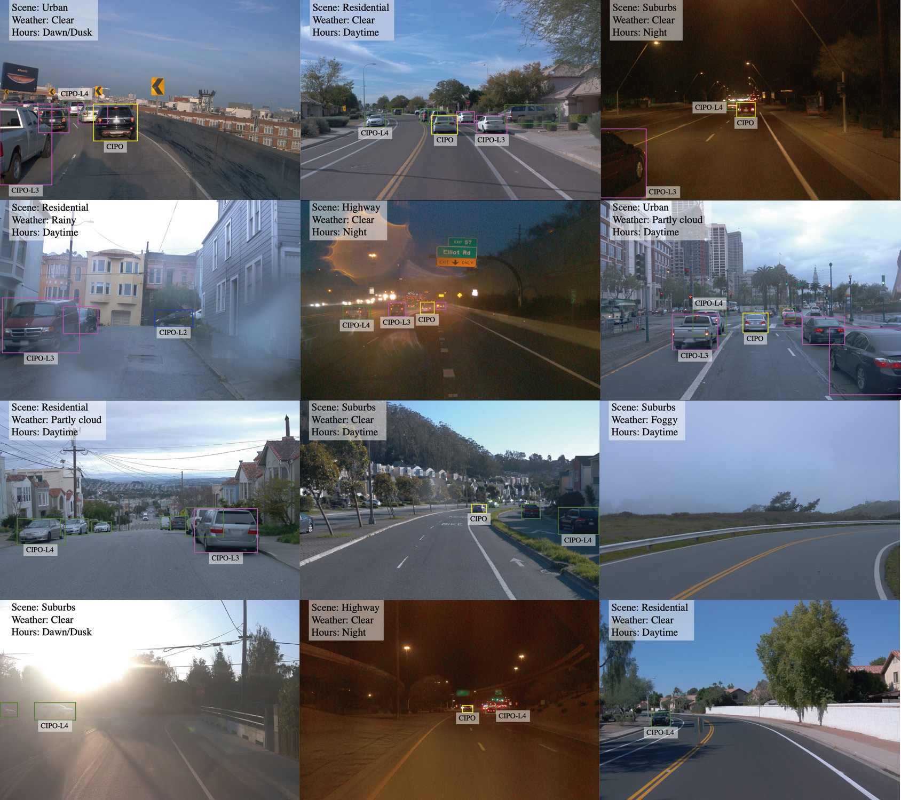

# CIPO & Scenes Annotation Criterion

Examples of visualizing CIPO&Scene annotation on 2D image are shown below.

 

## CIPO
We utilize 2D bounding boxes annotation from [Waymo Open Dataset](https://waymo.com/open/data/perception/) to generate CIPO annotation. To cover the complex scenarios, we categorize objects, mainly including vehicles, pedestrians and cyclists, into 4 different CIPO levels.

`Level 1`: The most important one, which is closest to ego vehicle within the required reaction distance and has over 50% part of it in the ego lane. Level 1 contains one object at most.

`Level 2`: Objects whose bodies interact with the real or virtual lines of ego lane, typically in the process of cut-in or cut-out.

`Level 3`: Objects mainly within the reaction distance or drivable area, or those in left/ego/right lanes, with occlusion rate less than 50%. Note that vehicles in the opposite direction can be in this CIPO level as well.

`Level 4`: The remains which are almost unlikely to impact the future path. They are mainly objects in lanes with far distance, objects out of drivable area, or parked vehicles in our dataset.

Here's the data format for CIPO annotation. The evaluation can be referred from [here](../../eval/CIPO_evaluation/README.md)
```
{
    "results": [                                (k objects in `results` list)
        {
            "width":                            <float> -- width of cipo bbox
            "height":                           <float> -- height of cipo bbox
            "x":                                <float> -- x axis of cipo bbox left-top corner
            "y":                                <float> -- y axis of cipo bbox left-top corner
            "id":                               <str> -- importance level of cipo
            "trackid":                          <str> -- tracking id of cipo, unique in the whole segment
            "type":                             <int> -- type of cipo
                                                            0: TYPE_UNKNOWN
                                                            1: TYPE_VEHICLE
                                                            2: TYPE_PEDESTRIAN
                                                            3: TYPE_SIGN
                                                            4: TYPE_CYCLIST
        },
        ...                                
    ],
    "raw_file_path":                            <str> -- image path
}
```


## Scene Tag
Here's the data format for Scene Tag annotation. 
```
{
    "segment-xxx":                              <str> -- segment id
    {
        "scene":                                <str> 
        "weather":                              <str>
        "time":                                 <str>
    }
    ...                                         (1000 segments)
}
```

`scene`: residential, urban, suburbs, highway, parking lot

`weather`: clear, partly cloud, overcast, rainy, foggy

`time`: daytime, night, dawn/dusk
